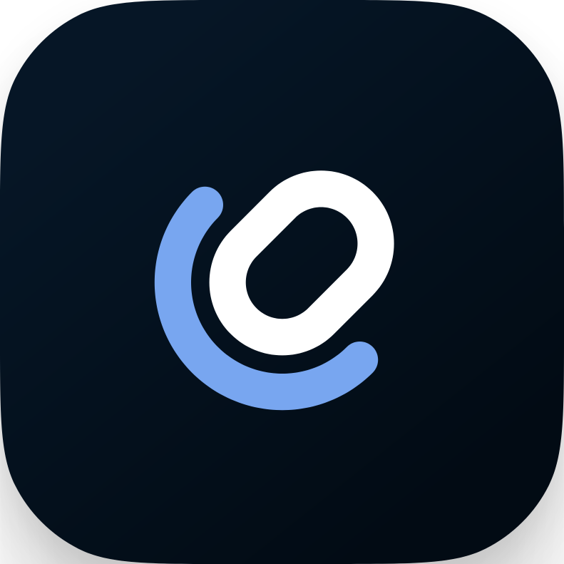

  <h1>MicYou iOS</h1>

  

   
   

<a href="./README_zh-cn.md">簡體中文</a> | <b>繁體中文</b> | <a href="./README.md">English</a>

MicYou iOS 是 MicYou 的官方 iOS 用戶端，可將您的 iPhone 變成 PC 的無線麥克風。

## 主要功能

- **Wi-Fi 連線**：透過本地網路無線連線至您的 PC。
- **音訊傳輸**：即時將 iPhone 音訊串流傳輸到 PC。
- **簡潔介面**：乾淨直覺的介面，快速設定和使用。

## 使用指南

1. 在 iPhone 上安裝 MicYou iOS 應用程式。
2. 在應用程式設定中配置 PC 的 IP 位址。
3. 點擊**連線**開始傳輸音訊。

## 說明

- 這是 MicYou 的**官方** iOS 用戶端。
- 該倉庫為獨立倉庫，**不包含**在 MicYou 倉庫內。
- 如遇到問題請在 [MicYou-iOS Issues](https://github.com/MicYou-Dev/MicYou-iOS/issues) 或 [ios2pc Issues](https://github.com/herbrine8403/ios2pc-myp-v2/issues) 中提交。

## 所有權

- **MicYou iOS** 由 [herbrine8403](https://github.com/herbrine8403) 主要維護，倉庫所有權歸 [MicYou-Dev](https://github.com/MicYou-Dev) 所有。
- **MicYou** 歸 [LanRhyme](https://github.com/LanRhyme) 所有（MicYou 作者）。

## 授權條款

本專案採用 [GNU General Public License v3.0](LICENSE) 授權條款。
